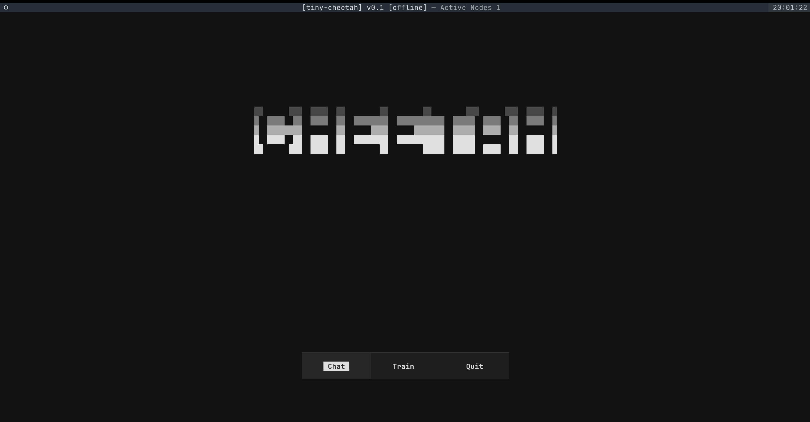
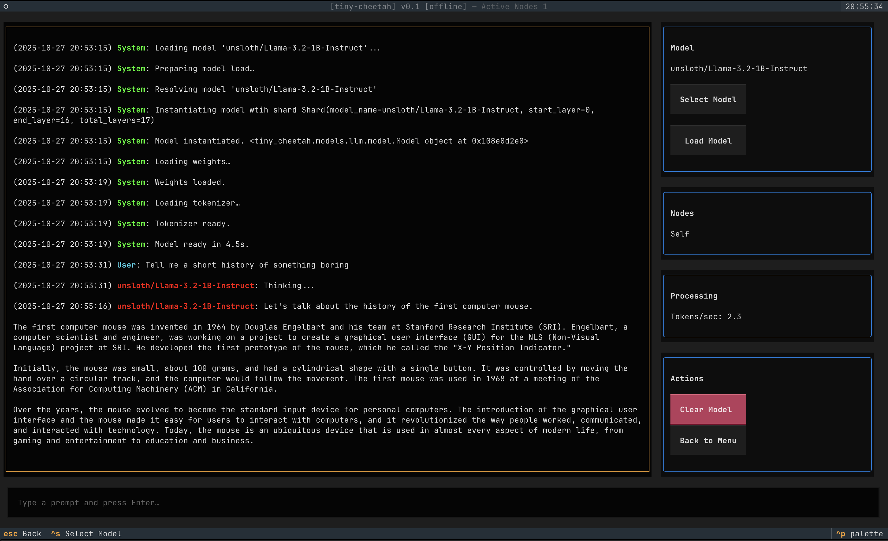

# Tiny Cheetah
```
░░      ░░░  ░░░░  ░░        ░░        ░░        ░░░      ░░░  ░░░░  ░
▒  ▒▒▒▒  ▒▒  ▒▒▒▒  ▒▒  ▒▒▒▒▒▒▒▒  ▒▒▒▒▒▒▒▒▒▒▒  ▒▒▒▒▒  ▒▒▒▒  ▒▒  ▒▒▒▒  ▒
▓  ▓▓▓▓▓▓▓▓        ▓▓      ▓▓▓▓      ▓▓▓▓▓▓▓  ▓▓▓▓▓  ▓▓▓▓  ▓▓        ▓
█  ████  ██  ████  ██  ████████  ███████████  █████        ██  ████  █
██      ███  ████  ██        ██        █████  █████  ████  ██  ████  █
```
Fast local training and inference using Tinygrad.






## About
WIP local TUI based model conversation and training at home interface with distributed network based inference.

TLDR: Chat and train models at home with all your devices and MMO with other users

## Progress
### 10/27/2025
Working chat interface and training interface but more UX work and optimization needed. We are finding there is this freezing or delay when loading a model into memory while in the chat interface. For training, better stop before running out of memory points will be needed as causing it to run unmanaged will thrash swap memory. Integrating tinyjit and quantization model usage for faster tokens/sec
