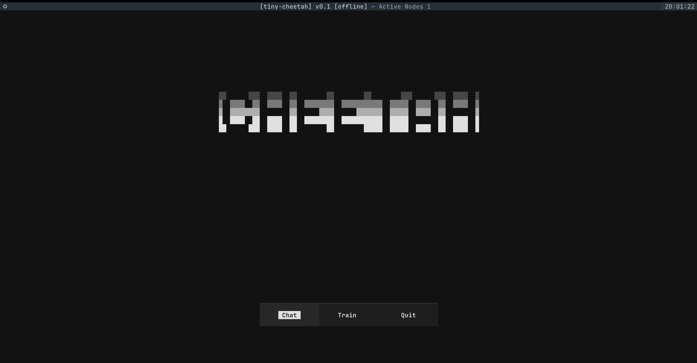
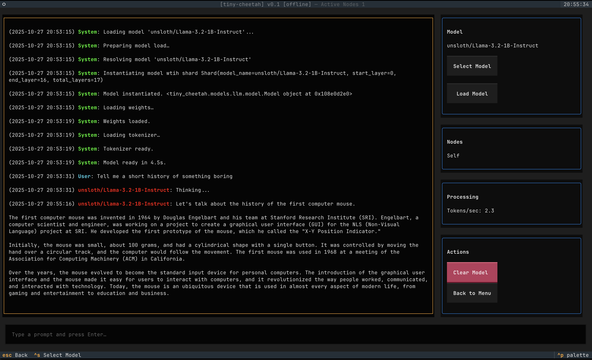
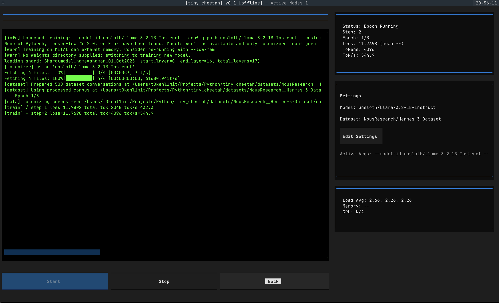

# Tiny Cheetah
```
░░      ░░░  ░░░░  ░░        ░░        ░░        ░░░      ░░░  ░░░░  ░
▒  ▒▒▒▒  ▒▒  ▒▒▒▒  ▒▒  ▒▒▒▒▒▒▒▒  ▒▒▒▒▒▒▒▒▒▒▒  ▒▒▒▒▒  ▒▒▒▒  ▒▒  ▒▒▒▒  ▒
▓  ▓▓▓▓▓▓▓▓        ▓▓      ▓▓▓▓      ▓▓▓▓▓▓▓  ▓▓▓▓▓  ▓▓▓▓  ▓▓        ▓
█  ████  ██  ████  ██  ████████  ███████████  █████        ██  ████  █
██      ███  ████  ██        ██        █████  █████  ████  ██  ████  █
```
Fast local training and inference using Tinygrad.







## About
WIP local TUI based model conversation and training at home interface with distributed network based inference.

TLDR: Chat and train models at home with all your devices or online with other users